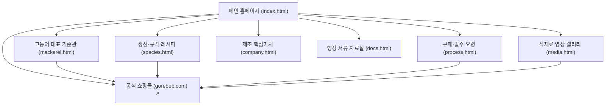

# [상세 제작명세서 v3.0] (주)자반고래밥 B2B 공식 정보관 구축 정의서

> **문서 버전:** v3.0 (최종 종합 개정판)  
> **대상 도메인:** `jaban.co.kr` (공식 정보관) / `gorebob.com` (공식 이커머스 쇼핑몰)  
> **프로토타입 경로:** `/Users/jiwoongkim/JABAN_project/JABAN_WEB/jaban-wordpress/prototype-gemini/`  
> **핵심 개정 방향:** 텍스트 나열을 지양하고, **카드뉴스형 비주얼 스텝·실물 컷·숏폼 비디오 연출**을 적재적소에 배치하여 영양사·식당 사장님뿐만 아니라 **사내 동료 및 외주 마케팅 담당자가 다양한 아이디어와 의욕을 가질 수 있는 완성도 높은 정보관 구축**

---

## 1. 프로젝트 개요 및 전략적 방향 (Executive Summary)

### 1.1 플랫폼 성격 및 Two-Track 도메인 전략
* **`jaban.co.kr` (공식 규격 정보관):**
  * **목적:** 식당 사장님과 단체급식(학교·병원·기업) 영양사/구매팀을 위한 B2B 전문 정보 및 솔루션 허브.
  * **핵심 가치:** 
    1. 생선 손질 3D 업무 완벽 대행 (주방 노동 0분, 비린내 0, 음식물 쓰레기 0%).
    2. HACCP 인증 직영 공장의 CCP-2P 금속검출 및 위생 안전성 검증.
    3. 100% 가식부 정량 규격 공급을 통한 실질적 식단 원가 절감.
  * **역할 분담:** 직접적인 결제 장바구니 기능을 분리하고, 어종별 규격 비교, 구매 프로세스 안내, 행정 서류(HACCP·성적서) 열람, 실패 없는 조리 매뉴얼, 샘플 상담 접수에 집중.
* **`gorebob.com` (공식 이커머스 쇼핑몰):**
  * **역할:** 카페24 기반 온라인 결제 및 정기 배송 주문 전용 몰.
  * **연계 방식:** 모든 페이지의 GNB 상단 `[고래밥몰에서 주문 ↗]` 버튼과 각 어종 카드, 조리 가이드 및 숏폼 모달 내부에서 다이렉트 구매 링크 상시 연동.

### 1.2 핵심 타깃 및 의사결정자별 니즈
1. **학교·병원·공공기관 단체급식 영양사:**
   * 대량 조리(50~500인분) 시 시간 절약, 가시 컴플레인 최소화(순살 필렛), 행정 증빙(HACCP, 시험성적서, 배상책임보험) 구비 여부.
2. **식당·생선구이 전문점 사장님:**
   * 주방 이모님 인건비 절감, 1초 언패킹 직화 팬 구이, 주문 즉시 5분 내 출고 가능한 원팩 솔루션, 안정적인 단가 및 납품 지속성.
3. **사내 동료 및 외주 마케팅 담당자:**
   * 지루한 텍스트 나열이 아닌 직관적 카드뉴스와 숏폼 연출을 통해, 인스타그램/블로그/유튜브 릴스 등 2차 바이럴 마케팅 아이디어를 즉시 도출할 수 있는 시각적 스토리보드 제공.

---

## 2. 전체 사이트 아키텍처 (Information Architecture)

---

## 3. 페이지별 상세 구조 및 기능 명세

### 3.1 메인 홈페이지 (`index.html`)

| 블록 | 영역명 | 목적 및 핵심 구성 요소 | 시각화 & 인터랙션 연출 |
| :--- | :--- | :--- | :--- |
| **Hero** | 메인 비주얼 & 목적별 진입로 | • 고등어 중심 B2B 가치 제안 헤드라인 • `[고등어 규격 안내]`, `[전체 어종 보기]` CTA • 3대 빠른 진입로 (기존고객 주문, 식당용 제품, 급식 상담) • 4대 신뢰 지표 (직영 제조, HACCP, 콜드체인, 원팩 1초) | • 황금빛 노릇한 고등어구이 실물 푸드 샷 (`hero.jpg`) 배경 • 카드 마우스 오버 시 플로팅 인터랙션 |
| **Block 1** | 함께 볼 3대 어종 (라인업) | • **노르웨이 고등어 (기준 상품):** 순살/토막, 100g~120g • **삼치 (급식 1위):** 가시 제거 순살, 60g~80g, 무염 • **임연수 (바삭한 껍질):** 나비필렛, 120g~140g, 구이 전문 | • 어종별 실물 컷 및 미니 스펙 테이블 • `[상세 규격 보기 →]`, `[고래밥몰 주문 ↗]` 투트랙 버튼 |
| **Block 2** | B2B 발주 프로세스 & 주문 요령 | • 규격 상담 $\rightarrow$ 발주 접수(14시 마감) $\rightarrow$ 직영 가공 $\rightarrow$ 콜드체인 직배송 4단계 • 포장 단위(10kg 벌크/개별팩), 익일 수령, 전자세금계산서 발행 | • **B2B 표준 납품 비주얼 쇼케이스 배너:** 실제 주방 냉동고 입고 실물 박스 사진 (`box_shipping.jpg`) • `[배식량 계산기 & 서식 보기 →]` 연계 |
| **Block 3** | 제조 시설 & 위생 안전 공정 | • 단순 유통이 아닌 직영 가공 공장의 안전성 증명 • 원물 선별 $\rightarrow$ 핀셋 탈골 $\rightarrow$ **금속검출 CCP-2P** $\rightarrow$ -40℃ 급속동결 | • **좌측 4단계 사진 카드뉴스 스텝** (`fillets_display.jpg`, `step_tray.jpg`, `step_metal.jpg`, `box_shipping.jpg`) • **우측 Before & After 비주얼 배너:** 3D 손질 주방(피비린내·쓰레기) vs 원팩 조리 비교 사진 (`kitchen_before_after.jpg`) • `▶ 0:45 공정 숏폼 보기` 비디오 모달 연동 |
| **Block 4** | 행정 서류 & 품질 자료실 | • 학교·병원·공공기관 결재 및 품의에 필요한 증빙 제공 • HACCP 지정서, 자가품질 시험성적서, 사업자등록증, 원산지증명서 | • 공문서 카드 UI • `[열람 및 다운로드 ↓]` 클릭 시 전용 자료실 이동 |
| **Block 5** | 조리 활용 & 30초 노하우 | • 조리 목적별 탭 구성: **🔥 구이용**, **🍲 조림용**, **🍤 튀김·강정용** • 콤비오븐 12분 공식, 솥 조리 형태 보존 팁, 순살 큐브 튀김 노하우 | • **탭마다 4단계 카드뉴스 스텝 매뉴얼** (STEP 1~4 실물 썸네일 탑재) • **상단 숏폼 비디오 배너** (`shorts_oven.jpg`, `shorts_braise.jpg`, `shorts_unpack.jpg`) • 클릭 시 숏폼 비디오 플레이어 모달 즉시 팝업 • `[표준 레시피 팝업]` 버튼 연동 |
| **Block 6** | 샘플 · 규격 상담 (Progressive) | • 단계적 정보 공개를 적용한 간편 상담 폼 • 3대 상담 목적 라디오 선택 (고등어 첫 검토 / 어종 추가 / 다른 규격) • 기관명, 연락처, 희망 규격, 개인정보 수집 동의 | • 초기 진입 장벽을 낮춘 깔끔한 카드형 폼 • 제출 시 조리 매니저 유선 상담 배정 안내 모달 |

---

### 3.2 고등어 대표 기준 상세관 (`mackerel.html`) - Golden Reference

다른 어종 페이지의 벤치마킹 기준이 되는 가장 완성도 높은 단일 어종 페이지입니다.

1. **Section 01 · 손질 형태 선택 (Visual Cards):**
   * **순살 필렛 (Fillet):** 반갈라 척추 뼈/내장 제거, 오븐 구이 최적, 100g~160g 규격 (실물 컷: `assets/fillets_display.jpg`).
   * **정량 토막 (Cut Pieces):** 중심 뼈 포함 균일 2~3토막, 조림/찌개 육수 풍미 유지, 60g~80g 규격 (실물 컷: `assets/shorts_braise.jpg`).
2. **Section 02 · 구매 전 확인표 (Check Table):**
   * 원산지(노르웨이 FAO 27), 포장단위(5kg/10kg 벌크/개별팩), 배식중량, 염지상태(저염 0.8~1.0%), 보관조건(-18℃ 이하) 5대 체크리스트 테이블.
3. **Section 03 · 실패 없는 주방 조리 가이드 (Cardnews & Shorts):**
   * **[카드뉴스 1] 콤비오븐 대량 조리 (단체급식 50인분+):**
     * 숏폼 배너: `▶ 0:30 숏폼 영상 보기 ("10분 만에 50토막 끝!" 오븐 세팅 현장)`
     * STEP 1: 완만 자연해동 (냉장고 0~4℃ 12시간) $\rightarrow$ `assets/fillets_display.jpg`
     * STEP 2: 타공 호일 정렬 (껍질 위, 2cm 간격) $\rightarrow$ `assets/step_tray.jpg`
     * STEP 3: 콤비 200℃ 12분 (습도 20% 속살 스팀) $\rightarrow$ `assets/shorts_oven.jpg`
     * STEP 4: 건열 2분 바삭마무리 (수분 날리기) $\rightarrow$ `assets/hero.jpg`
   * **[카드뉴스 2] 팬 & 그리들 직화 조리 (일반 식당):**
     * 숏폼 배너: `▶ 0:20 숏폼 영상 보기 (1초 언패킹 & 직화 팬 조리)`
     * STEP 1: 표면 수분 제거 (키친타월 닦기) $\rightarrow$ `assets/shorts_unpack.jpg`
     * STEP 2: 살코기 70% 구이 (중약불 4분) $\rightarrow$ `assets/hero.jpg`
     * STEP 3: 껍질 쪽 뒤집기 (뒤집개 4~5분 노릇 구이) $\rightarrow$ `assets/step_pan.jpg`
     * STEP 4: 자체 유분 튀김 (뚜껑 열고 바삭 완성) $\rightarrow$ `assets/fillets_display.jpg`

---

### 3.3 어종별 상세 규격 및 실전 레시피 아카이브 (`species.html`)

1. **3대 어종 상세 규격 카드:** 고등어, 삼치, 임연수 어종별 원산지, 손질형태, 배식규격, 포장단위, 염지상태 정리.
2. **6종 실전 단체급식 레시피 라이브러리:**
   * 조리실에서 검증된 메뉴 6종 (오븐구이, 시래기조림, 삼치 데리야끼, 순살 탕수강정, 갈릭버터구이, 감자고추장조림).
   * 각 카드 클릭 시 **레시피 상세 모달(`recipeModal`)** 팝업 (식재료 계량, 5단계 상세 조리법, 사용 생선 고래밥몰 바로 구매 버튼 연동).

---

### 3.4 식재료 영상 및 숏폼 갤러리 (`media.html`)

1. **6종 숏폼/영상 큐레이션:**
   * 0:30 콤비오븐 대량 세팅 현장 (`shorts_oven.jpg`)
   * 0:20 손에 물 안 묻히는 1초 언패킹 직화 팬 구이 (`shorts_unpack.jpg`)
   * 0:35 살이 안 부서지는 정량 토막 조림 비법 (`shorts_braise.jpg`)
   * 0:45 가시 없는 순살 삼치 데리야끼 글레이즈 (`fillets_display.jpg`)
   * 0:40 HACCP CCP-2P 디지털 금속검출 공정 실황 (`step_metal.jpg`)
   * 0:30 생선 껍질 안 눌어붙는 타공 종이호일 공식 (`step_tray.jpg`)
2. **9:16 모바일 숏폼 비디오 플레이어 모달 (`videoPlayerModal`):**
   * 카드 클릭 시 풀스크린 반응형 숏폼 모달 재생, 영상 핵심 해설 자막 노출, 하단 영상 속 제품 구매 링크 배치.

---

### 3.5 제조 핵심가치 및 공장 스토리 (`company.html`)

1. **CORE VALUE 01 · 주방 노동 전처리 제로화:**
   * **대형 실물 비교 배너 (`kitchen_before_after.jpg`):** 번거롭고 지저분한 도마 위 3D 손질 현장 vs 깨끗한 스테인리스 작업대 위 원팩 조리 비교.
   * **Before vs After 카드:** 시간 소모(1시간 $\rightarrow$ 2분), 싱크대 핏물 오염(위험 $\rightarrow$ 제로), 쓰레기 배출(40% 발생 $\rightarrow$ 0%).
2. **CORE VALUE 02 · HACCP 직영 공장의 6단계 위생 공정:**
   * 1. 위생 할복 & 세척 (`fillets_display.jpg`)
   * 2. 핀셋 정밀 탈골 (`step_tray.jpg`)
   * 3. 천일염 저염 염장 (`hero.jpg`)
   * 4. **금속검출 CCP-2P 전수 검사 (`step_metal.jpg`)** ★ 핵심관리점 배지
   * 5. -40℃ 터널 프리저 급속동결 (`shorts_oven.jpg`)
   * 6. 진공포장 & 10kg 규격 박스 패킹 (`box_shipping.jpg`)
3. **공장 시설 요약:** 부산광역시 사하구 소재, 식약처 HACCP 인증, 주요 공급처(학교/병원/기업/식당).

---

### 3.6 구매·발주 요령 & 배식량 자동 계산기 (`process.html`)

1. **인터랙티브 1인 배식량 & 발주량 자동 계산기:**
   * 입력: 배식 인원수(명), 1인 목표 중량(60g 유아식 / 80g 일반급식 / 100g 성인급식 / 120g 특식).
   * 실시간 연산 출력: 필요 순수 가식부(kg), 권장 10kg 벌크 박스 수 자동 산출.
2. **B2B 표준 벌크 박스 쇼케이스 (`box_shipping.jpg`):**
   * 사업장에 실제 배송되는 차폐 냉동 박스 실물 컷 노출.
3. **표준 발주 4단계 & 3대 체크사항:**
   * 상담 $\rightarrow$ 14시 마감 발주 $\rightarrow$ 직영 가공 $\rightarrow$ 전국 콜드체인 직배송.
   * 포장 단위, 출고 마감, 세금계산서 조건 안내.

---

### 3.7 품질 서류 및 행정 자료실 (`docs.html`)

영양사와 구매팀이 기관 내부 품의를 위해 다운로드해야 하는 6종 핵심 서류:
1. 식약처 HACCP 적용업소 지정서 사본
2. 공인시험기관 자가품질검사 시험성적서 (미생물·중금속·방사능 적합)
3. 사업자등록증 및 식품제조가공업 영업신고증
4. 원산지 증명서 및 수입신고필증 (노르웨이 FAO 27 정품)
5. 현대해상 생산물 배상책임보험 증권 사본 (1사고당 1억원)
6. 단체급식 표준 제품 규격서 및 품의용 스펙 시트
* 기능: **문서 내용 미리보기 모달(`docModal`)** 지원 및 PDF 다운로드 버튼.

---

## 4. UI/UX 디자인 시스템 및 기술 스택

### 4.1 컬러 팔레트 & 타이포그래피
* **Primary Deep Navy (`#0f172a`):** 신뢰성과 식품 제조사의 전문성을 대변하는 바탕색.
* **Secondary Ocean Blue (`#0284c7`):** 신선한 수산물과 콜드체인을 상징하는 포인트 컬러.
* **Accent Vivid Coral/Red (`#ef4444` / `#b91c1c`):** CCP-2P 금속검출 핵심관리점, 조리 숏폼 비디오 배지, 주의사항 강조.
* **Warm Cream / Gray (`#f8fafc` / `#e2e8f0`):** 가독성을 극대화하는 정돈된 배경 및 보더.
* **Typography:** `Pretendard`, Apple SD Gothic Neo, sans-serif 시스템 폰트 스택.

### 4.2 반응형 레이아웃 가이드라인
* 데스크톱(1280px+): 2열~4열 그리드, 비주얼 배너와 텍스트의 조화로운 분할.
* 태블릿(768px~1024px): 2열 그리드 및 탭 전환 유지.
* 모바일(360px~767px): 1열 수직 스택, 터치 친화적 버튼(최소 48px), 모달 풀스크린 최적화, 가로 넘침(Horizontal Overflow) 제로.

---

## 5. 사내 동료 및 외주 마케팅 협업 가이드 (Marketing & Creative Playbook)

본 사이트는 단순한 웹페이지가 아니라 **전사 마케팅 자산의 스토리보드**입니다:

| 홈페이지 구성 요소 | SNS / 마케팅 활용 방안 | 콘텐츠 제작 아이디어 (동료/외주사) |
| :--- | :--- | :--- |
| **4단계 오븐 조리 카드뉴스** | 인스타그램 / 블로그 카드뉴스 4장 배포 | "오븐에 생선 굽다 망한 영양사님을 위한 4단계 황금 공식" (조회수 타깃) |
| **1초 언패킹 직화 영상** | 유튜브 쇼츠 / 인스타 릴스 (15초) | "생선 비린내 싱크대에서 영원히 퇴출! 1초 언패킹 쾌감" (주방 조리원 공감) |
| **3D 손질 Before/After** | B2B 메타/검색 광고 크리에이티브 | "도마 위 생선 내장 쓰레기 40%, 언제까지 치우실 겁니까?" (직관적 후킹) |
| **HACCP CCP-2P 금속검출** | 공식 블로그 / 제안서 신뢰 브랜딩 | "학교급식 영양사님이 밤잠 편히 주무시는 이유: 디지털 금속검출 전수검사" |
| **1인 배식량 계산기** | 영양사 커뮤니티 바이럴 툴 | "인원수만 넣으면 발주 박스가 1초 만에 계산되는 무료 급식 계산기" |

---

## 6. 개발 및 배포 환경 점검

* **소스 코드 디렉토리:** `/Users/jiwoongkim/JABAN_project/JABAN_WEB/jaban-wordpress/prototype-gemini/`
* **파일 구성:**
  * `index.html`: 메인 랜딩 쇼케이스
  * `mackerel.html`: 고등어 기준 상세관
  * `species.html`: 어종 규격 & 실전 레시피
  * `process.html`: 구매 프로세스 & 배식량 계산기
  * `company.html`: 핵심가치 & 공장 스토리
  * `docs.html`: 행정 서류 자료실
  * `media.html`: 영상 갤러리
  * `style.css`: 전체 비주얼 카드뉴스 및 반응형 스타일시트
  * `site.js`: 모달 3종, 탭 전환, 실시간 계산기 스크립트
  * `assets/`: 10종의 고화질 실사 및 실증 연출 이미지 완비
* **구문 및 정합성 검증:** JavaScript 문법 검사 통과(`node -c site.js`), 모든 HTML 내부 에셋 링크 실존 확인 완료.
