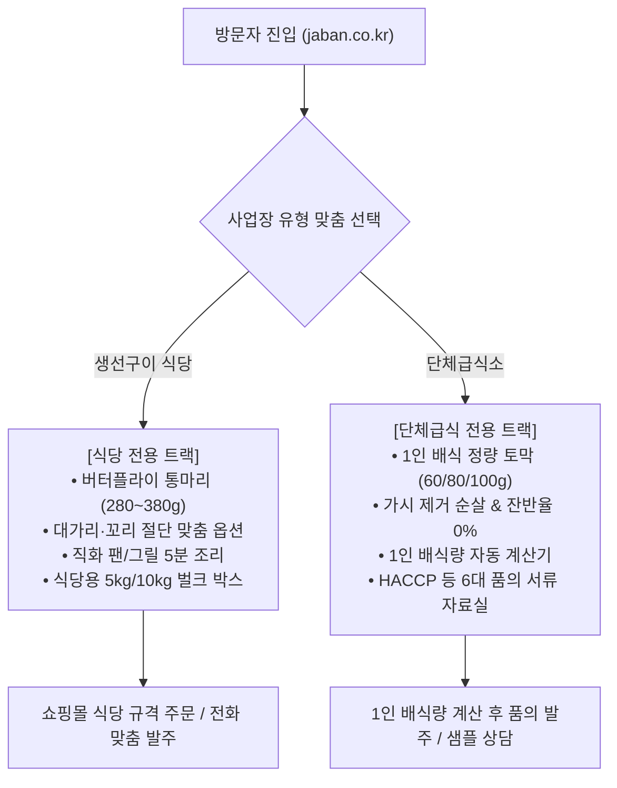

# [상세 제작명세서 v3.1] (주)자반고래밥 B2B 공식 정보관 구축 정의서
> **개정 부제:** 생선구이 식당(버터플라이 & 두미절단) vs 단체급식소(1인 정량토막 & 계산기) 맞춤 듀얼 트랙(Dual Track) 프로세스 확립

> **문서 버전:** v3.1 (사업장 성향 분기 및 맞춤 프로세스 고도화)  
> **대상 도메인:** `jaban.co.kr` (공식 정보관) / `gorebob.com` (공식 이커머스 쇼핑몰)  
> **프로토타입 경로:** `/Users/jiwoongkim/JABAN_project/JABAN_WEB/jaban-wordpress/prototype-gemini/`  

---

## 1. 프로젝트 개요 및 전략적 방향 (Executive Summary)

### 1.1 핵심 문제 인식 및 듀얼 트랙(Dual Track) 분기 배경
* **기존 문제점:**  
  * 생선구이 식당과 단체급식소는 모두 대량의 생선을 사용하는 B2B 사업장이지만, **추구하는 가공 형태와 발주 및 조리 성향이 완전히 상이**합니다.
  * 이전 초안에서는 두 컨셉이 애매하게 뒤섞여 있어, 식당 사장님에게는 불필요한 배식량 계산기나 서류가 먼저 보이고, 영양사님에게는 식당용 통마리 상차림이 섞여 이해를 방해했습니다.
* **해결 방안 (맞춤 듀얼 트랙 체계):**
  * 사이트 첫 진입부터 **[🍽️ 생선구이 식당 사장님 관]**과 **[🏫 단체급식 영양사 · 구매팀 관]**으로 명확히 경로를 분기하여 각각의 사업장 환경에 최적화된 프로세스를 제공합니다.

### 1.2 두 구매 담당자별 성향 및 가공 솔루션 비교

| 구분 | 🍽️ 생선구이 전문점 · 일반 식당 | 🏫 단체급식소 (학교 · 병원 · 기업) |
| :--- | :--- | :--- |
| **핵심 구매 목적** | 손님상 1인분 상차림의 시각적 만족감, 빠른 테이블 회전 | 누구는 크고 누구는 작은 배식 편차(불만) 제로, 안전한 잔반율 0% |
| **선호 가공 형태** | **자반고래밥 버터플라이 (배갈라 펼친 통마리)** | **1인 배식 기준 정량 균일 토막 (Equal-Cut) & 순살 컷** |
| **추가 맞춤 가공** | **대가리(두부) 제거, 꼬리 절단, 지느러미 트리밍, 2등분 컷** | **1차 핀본 가시 제거 순살, 중심 뼈 포함 조림용 토막** |
| **표준 배식 규격** | 마리당 280~320g (백반용), 330~380g (특대 구이정식) | 1토막당 60g (유아/초등), 70~80g (중고등/일반), 100g (특식) |
| **주요 조리 방식** | 생선구이기, 가스 그리들 직화 5분 초고속 서빙 | 콤비오븐 타공 팬·종이호일 100~500인분 12분 대량 조리 |
| **필수 행정 지원** | 간편 전자세금계산서, 식당용 5kg/10kg 박스 출고 | 식약처 HACCP 지정서, 자가품질검사 성적서, 원산지증명서 |

---

## 2. 전체 사이트 아키텍처 및 듀얼 트랙 흐름

---

## 3. 페이지별 세부 구현 명세

### 3.1 메인 홈페이지 (`index.html`)

1. **Hero & 듀얼 트랙 컴포넌트 (`dual-track-wrapper`):**
   * 헤더 비주얼 아래에 **"우리 사업장에 꼭 맞는 가공 형태와 발주 프로세스를 선택하세요"** 듀얼 카드 배치:
     * **[트랙 1: 생선구이 식당 전용]**
       - 실물 컷: 배를 갈라 양쪽으로 펼친 통마리 자반고등어 상차림 (`assets/butterfly_mackerel.jpg`).
       - 주요 안내: 통마리 버터플라이, 대가리·꼬리 절단 맞춤 가공, 직화 5분 서빙, 식당용 박스.
       - 버튼: `[식당 맞춤 규격 & 가공 보기 →]`, `[고래밥몰 주문 ↗]`.
     * **[트랙 2: 단체급식 영양사 전용]**
       - 실물 컷: 급식 조리사가 든 콤비오븐 트레이 위 1인 배식용 정량 균일 토막 (`assets/catering_portions.jpg`).
       - 주요 안내: 1인 정량 배식 토막(60/80/100g), 가시제거 순살, 콤비오븐 대량 매뉴얼, HACCP 서류 구비.
       - 버튼: `[1인 배식량 계산기 & 서식 →]`, `[급식 샘플 신청]`.
2. **Block 2 · B2B 납품 쇼케이스:** 10kg/5kg 표준 출고 벌크 박스 및 콜드체인 실물 컷 (`assets/box_shipping.jpg`).
3. **Block 3 · 6단계 위생 공정 & Before/After:** 
   * 4단계 사진 카드뉴스(원물선별, 탈골, CCP-2P 금속검출, 급속동결)
   * 3D 손질 주방(쓰레기 40%, 핏물) vs 자반고래밥 원팩(1초 개봉, 쓰레기 0%) 비교 컷 (`assets/kitchen_before_after.jpg`).
4. **Block 5 · 조리 활용 가이드:** 구이(오븐/직화), 조림(대형솥/뚝배기), 튀김(순살 큐브) 3개 탭 카드뉴스 스텝.
5. **Block 6 · 샘플 및 규격 상담 폼:** 
   * 1번 질문: **사업장 구분 라디오 (식당 / 급식소 / 유통·프랜차이즈)** 필수 선택 분기.

---

### 3.2 고등어 대표 기준관 (`mackerel.html`) - Golden Reference

1. **Section 01 · 사업장별 맞춤 가공 형태 선택:**
   * **[생선구이 식당 추천] 버터플라이 통마리 (Butterfly Cut):**
     * 썸네일: `assets/butterfly_mackerel.jpg`
     * 규격: 280~320g(중대), 330~380g(특대)
     * **★ 3대 맞춤 가공 옵션 제공:**
       - ① 원형 유지 (대가리·꼬리 온전 포함)
       - ② 대가리·꼬리 절단 (그릴 면적 30% 절약, 빠른 조리)
       - ③ 2등분 반절 컷 (소형 팬·그리들 맞춤)
   * **[단체급식소 추천] 1인 배식 정량 토막 & 순살 컷 (Equal-Cut):**
     * 썸네일: `assets/catering_portions.jpg`
     * 규격: 60g(유아/초등), 70~80g(중고등/일반), 100g(성인/특식)
     * **★ 급식 안전 가공 옵션 제공:**
       - ① 가시 1차 제거 순살 (오븐 구이용)
       - ② 중심 뼈 포함 토막 (대형 솥 조림용)
       - ③ 비가식부 0% 보장 (주방 잔여 쓰레기 제로)
2. **Section 02 · 고등어 구매 전 점검표:** 원산지(노르웨이 FAO 27), 포장단위, 배식중량, 염도(0.8~1.0%), 보관온도 대조.
3. **Section 03 · 실패 없는 조리 매뉴얼:**
   * 콤비오븐 대량 조리 4단계 카드뉴스 (단체급식 50인분+) + 0:30 숏폼 모달
   * 팬 & 그리들 직화 조리 4단계 카드뉴스 (일반 식당) + 0:20 숏폼 모달

---

### 3.3 구매·발주 요령 & 자동 계산기 (`process.html`)

1. **발주 프로세스 듀얼 탭 (`.process-tab-container`):**
   * **[탭 1] 🍽️ 생선구이 식당 / 일반 음식점 발주 프로세스:**
     * STEP 1: 마리당 규격 선택 (280~380g)
     * STEP 2: 맞춤 절단 옵션 협의 (원형 / 두미 절단 / 반토막)
     * STEP 3: 14시 이전 주문 접수 (고래밥몰 또는 전화)
     * STEP 4: 그릴 직화 5분 서빙 (비린내 없는 쾌속 테이블 회전)
     * 우측에 식당 상차림 실물 카드 (`assets/butterfly_mackerel.jpg`) 매핑
   * **[탭 2] 🏫 단체급식소 (학교 · 병원 · 기업) 발주 프로세스:**
     * **1인 배식량 & 발주 박스 자동 계산기 탑재** (인원수, 1인 중량 선택 시 총 kg 및 10kg 박스 수 즉시 산출)
     * STEP 1: 배식 중량 규격 확정 (60g~100g 정량 컷)
     * STEP 2: 행정 및 품의 서류 구비 (HACCP, 성적서, 원산지증명서)
     * STEP 3: 10kg 표준 벌크 박스 콜드체인 입고
     * STEP 4: 콤비오븐 타공 호일 12분 대량 조리 및 배식
     * 우측에 급식 트레이 실물 카드 (`assets/catering_portions.jpg`) 매핑

---

### 3.4 어종별 규격 및 실전 레시피 (`species.html`)

* 어종 카드 내 스펙 테이블에서 식당용과 급식용 규격을 명확히 분리:
  * **고등어:** [식당] 버터플라이 통마리 280~380g / [급식] 1인 정량토막·순살 60~100g
  * **삼치:** [식당] 구이용 대형 필렛 120~150g / [급식] 순살 큐브 60~80g
  * **임연수:** [식당] 나비필렛(버터플라이) 130~160g / [급식] 순살 컷, 반건조 토막 70~90g
* 6종 단체급식/업소용 실전 레시피 모달 연계.

---

## 4. 사내 동료 및 외주 마케팅 협업 시사점

1. **외주 광고 집행 시 타깃별 소재 분리:**
   * **식당 타깃 광고:** "손님상에 나가는 통마리 자반고등어, 대가리·꼬리까지 잘라서 보내드립니다" (그릴 면적 절약, 인건비 절감 강조).
   * **급식 영양사 타깃 광고:** "배식 크기 불만 제로! 70g 정량 컷 & 핀셋 가시제거 순살로 잔반율 0% 실현" (HACCP 서류 100% 구비 강조).
2. **콘텐츠 제작 효율성:**
   * 메인 웹사이트의 듀얼 트랙 구성을 그대로 인스타그램 카드뉴스와 릴스/쇼츠 시리즈의 기획 템플릿으로 활용 가능.
