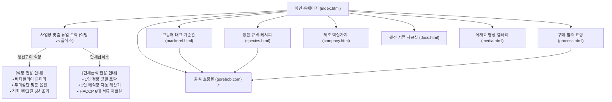

# [상세 제작명세서 v3.2] (주)자반고래밥 B2B 공식 규격 정보관 구축 정의서
> **부제:** 웹디자인 구조 명세 및 구매·발주요령 이원화(생선구이 식당 vs 단체급식소) 듀얼 트랙 완전 통합본

---

## 📋 문서 메타데이터

| 항목 | 내용 |
| :--- | :--- |
| **문서 버전** | **v3.2 (웹디자인 구조 명세 및 이원화 체계 완전 통합본)** |
| **최종 개정일** | 2026년 10월 7일 |
| **대상 도메인** | `jaban.co.kr` (B2B 공식 규격 정보관) / `gorebob.com` (공식 이커머스 쇼핑몰) |
| **소스 코드 경로** | `/Users/jiwoongkim/JABAN_project/JABAN_WEB/jaban-wordpress/prototype-gemini/` |
| **핵심 설계 방향** | 텍스트 나열을 지양하고 **카드뉴스형 비주얼 스텝·실물 컷·숏폼 연출**을 채택하며, **생선구이 식당과 단체급식소의 상이한 구매 목적을 완벽히 이원화한 듀얼 트랙(Dual Track)** 구축 |

---

## 1. 프로젝트 개요 및 전략적 방향 (Executive Summary)

### 1.1 플랫폼 성격 및 Two-Track 도메인 전략
* **`jaban.co.kr` (B2B 규격 공식 정보관):**
  * **목적:** 식당 사장님과 단체급식(학교·병원·기업) 영양사/구매팀을 위한 B2B 수산물 가공 규격 정보, 제조 공정 및 위생 검증, 행정 서류 자료실, 실패 없는 조리 매뉴얼, 단계적 샘플 상담 접수관.
  * **핵심 가치 제안:**
    1. **생선 손질 3D 업무 완벽 대행:** 주방 손질 노동 0분, 싱크대 비린내 0, 음식물 쓰레기 배출 0%.
    2. **HACCP 직영 가공 공장의 안전성:** 최신 디지털 금속검출기 CCP-2P 전수 검사 통과.
    3. **100% 가식부 정량 규격 공급:** 비가식부(내장·머리) 사전 제거로 주방 실질 식단 원가 절감.
* **`gorebob.com` (공식 이커머스 쇼핑몰):**
  * **역할:** 카페24 기반 온라인 결제 및 정기 배송 주문 전용 몰.
  * **연계 방식:** 모든 페이지의 GNB 상단 `[고래밥몰에서 주문 ↗]` 버튼 및 각 어종 카드, 조리 가이드, 숏폼 모달 내부에서 다이렉트 구매 링크 상시 연동.

### 1.2 구매 담당자 이원화(Dual Track) 핵심 배경

| 구분 | 🍽️ 생선구이 전문점 · 일반 식당 | 🏫 단체급식소 (학교 · 병원 · 기업) |
| :--- | :--- | :--- |
| **구매 의사결정자** | 식당 사장님, 총괄 조리장 | 영양사, 단체급식 구매팀장 |
| **핵심 구매 목적** | 손님상 1인분 상차림의 푸짐한 시각적 비주얼, 빠른 테이블 회전율 | 피급식자 간 배식 편차(크기 불만) 제로, 안전한 잔반율 0% |
| **선호 가공 형태** | **자반고래밥 버터플라이 (배갈라 펼친 통마리)** | **1인 배식 기준 정량 균일 토막 (Equal-Cut) & 순살 컷** |
| **추가 맞춤 가공** | **대가리(두부) 제거, 꼬리 절단, 지느러미 트리밍, 2등분 컷** | **1차 핀본 가시 제거 순살, 중심 뼈 포함 조림용 토막** |
| **표준 배식 규격** | 마리당 280~320g (백반용), 330~380g (특대 구이정식) | 1토막당 60g (유아/초등), 70~80g (중고등/일반), 100g (특식) |
| **주요 조리 방식** | 가스 그리들, 직화 생선구이기 5분 초고속 서빙 | 콤비오븐 타공 팬·종이호일 100~500인분 12분 대량 조리 |
| **필수 행정 지원** | 간편 전자세금계산서, 식당용 5kg/10kg 벌크 박스 출고 | 식약처 HACCP 지정서, 자가품질검사 성적서, 원산지증명서 |

---

## 2. 웹디자인 시스템 명세 (Design System & UI Tokens)

### 2.1 디자인 원칙 (Core Principles)
1. **No Boring Text (카드뉴스 & 시각화):** 긴 글 줄글과 불렛 나열을 금지하고, 모든 설명은 `STEP 1~4 카드뉴스`, `실물 썸네일`, `숏폼 영상 배너`로 연출.
2. **Dual-Persona Clarity (이원화 명확성):** 식당 사장님과 급식 영양사가 자기에게 필요한 정보만 한눈에 골라볼 수 있도록 시각적 뱃지와 전용 탭 제공.
3. **Trust & Sanitation (위생 신뢰감):** HACCP 레드 배지, CCP-2P 강조, 깨끗한 스테인리스 주방 컷을 통해 식품제조사의 전문성 전달.

### 2.2 스타일 토큰 (CSS Variables Specification)

```css
:root {
  /* Brand Colors */
  --color-primary: #0f172a;        /* Deep Slate Navy (신뢰, 안정, 헤더, 타이틀) */
  --color-primary-light: #1e293b;  /* Slate Navy Hover */
  --color-secondary: #0284c7;      /* Ocean Blue (신선도, 콜드체인, 액션 링크) */
  --color-secondary-hover: #0369a1;
  --color-restaurant: #ea580c;     /* Warm Amber/Orange (식당 직화구이 전용 포인트) */
  --color-catering: #0284c7;       /* Clean Cyan/Blue (단체급식 전용 포인트) */
  --color-danger: #ef4444;         /* Vivid Red (CCP-2P 금속검출, 숏폼 배지) */

  /* Neutral Surface Colors */
  --color-bg: #ffffff;
  --color-bg-subtle: #f8fafc;     /* Soft Cool Gray (카드 및 인풋 배경) */
  --color-bg-muted: #f1f5f9;
  --color-border: #e2e8f0;        /* Subtle Border */
  --color-border-dark: #cbd5e1;
  --color-text: #334155;          /* Body Text */
  --color-text-muted: #64748b;    /* Muted Labels */

  /* Layout & Geometry */
  --max-width: 1200px;
  --radius-sm: 6px;
  --radius-md: 10px;
  --radius-lg: 16px;

  /* Shadows */
  --shadow-sm: 0 1px 3px rgba(0, 0, 0, 0.08);
  --shadow-md: 0 4px 12px rgba(0, 0, 0, 0.08);
  --shadow-lg: 0 10px 25px rgba(0, 0, 0, 0.12);
}
```

### 2.3 레이아웃 프레임워크 및 반응형 그리드
* **데스크톱 (Desktop $\ge$ 1200px):**
  * 메인 컨테이너 최대 너비: `1200px` (중앙 정렬, 좌우 여백 `1.5rem`).
  * 듀얼 트랙 컴포넌트: `1fr 1fr` 2열 분할.
  * 카드뉴스 스텝: `repeat(2, 1fr)` 또는 `repeat(4, 1fr)`.
  * 비주얼 쇼케이스: `1.15fr 0.85fr` 비대칭 분할.
* **태블릿 (Tablet 768px ~ 1024px):**
  * 듀얼 트랙 및 주요 그리드 `1fr 1fr` 유지, 탭 메뉴 가로 스크롤 허용.
* **모바일 (Mobile $\le$ 767px):**
  * 전체 수직 1열 스택 (`grid-template-columns: 1fr`).
  * 터치 타겟 최소 높이: `44px ~ 48px`.
  * 가로 넘침(Horizontal Overflow) 제로화 (`overflow-x: hidden`).

---

## 3. 전체 사이트 아키텍처 (Information Architecture)



---

## 4. 페이지별 웹디자인 구조 및 상세 기능 명세

### 4.1 메인 홈페이지 (`index.html`)

| 블록 번호 | UI 컴포넌트명 | 디자인 구조 및 그리드 | 기능 및 콘텐츠 명세 | 연계 에셋 |
| :--- | :--- | :--- | :--- | :--- |
| **Hero** | Hero Visual & Quick Entry | • 1.2fr (헤드라인+CTA) : 0.8fr (실물 프리뷰)<br>• 4대 신뢰 지표 플로팅 바 | • 고등어 중심 B2B 대표 메시지<br>• 직영 제조, HACCP, 콜드체인, 원팩 1초 지표 노출 | `hero.jpg` |
| **Dual Track** | **사업장 맞춤 듀얼 트랙 (`dual-track-wrapper`)** | • 1fr : 1fr 2열 대형 분기 카드<br>• 상단 오버레이 뱃지 (식당 오렌지 / 급식 블루) | **① 식당 트랙:** 통마리 버터플라이(280~380g), 대가리·꼬리 절단 맞춤 가공, 직화 5분 서빙 안내.<br>**② 급식 트랙:** 1인 배식 정량 토막(60~100g), 가시제거 순살, 콤비오븐 매뉴얼, HACCP 구비 안내. | `butterfly_mackerel.jpg`<br>`catering_portions.jpg` |
| **Block 1** | 3대 어종 가공 규격 (`#species`) | • 3열 카드 그리드 (`repeat(3, 1fr)`)<br>• 미니 스펙 테이블 및 쇼핑몰 링크 | • 고등어 (기준 상품: 버터플라이 / 정량 토막)<br>• 삼치 (급식 1위: 순살 필렛, 큐브 토막)<br>• 임연수 (구이 전문: 나비필렛, 반건조) | `hero.jpg`<br>`fillets_display.jpg`<br>`shorts_oven.jpg` |
| **Block 2** | B2B 납품 쇼케이스 (`#process`) | • 1fr : 1fr 분할 박스 배너 (`delivery-showcase-box`) | • **10kg/5kg 표준 출고 벌크 박스 실물 컷 노출**<br>• 손질 인건비 0원, 100% 가식부 정량 출고<br>• `[배식량 계산기 & 서식 보기 →]` 연계 | `box_shipping.jpg` |
| **Block 3** | 제조 시설 & 위생 공정 (`#quality`) | • 1.15fr (4단계 카드뉴스) : 0.85fr (Before/After 배너) | • **좌측 4단계 스텝:** 원물선별 $\rightarrow$ 핀셋탈골 $\rightarrow$ CCP-2P 금속검출 $\rightarrow$ 급속동결<br>• **우측 Before/After:** 3D 손질 주방(피비린내·쓰레기 40%) vs 자반고래밥 원팩(1초 개봉, 쓰레기 0%) 실물 컷<br>• `▶ 0:45 공정 숏폼` 모달 연동 | `fillets_display.jpg`<br>`step_tray.jpg`<br>`step_metal.jpg`<br>`kitchen_before_after.jpg` |
| **Block 4** | 행정 서류 자료실 (`#docs`) | • 4열 카드 그리드 (`repeat(4, 1fr)`) | • HACCP 지정서, 시험검사 성적서, 사업자등록증, 원산지증명서 원클릭 열람 지원 | 문서 아이콘 UI |
| **Block 5** | 조리 활용 & 노하우 (`#cooking`) | • 3개 탭 네비게이션 (`cook-tab-btn`)<br>• 탭 내부: 숏폼 배너 + 4단계 카드뉴스 스텝 | • **구이용 탭:** 콤비오븐 12분 공식 & 0:30 숏폼<br>• **조림용 탭:** 대형 솥 형태 보존 비법 & 0:30 숏폼<br>• **튀김용 탭:** 순살 삼치 탕수강정 & 0:20 숏폼 | `shorts_oven.jpg`<br>`shorts_braise.jpg`<br>`shorts_unpack.jpg` |
| **Block 6** | 샘플 · 규격 상담 (`#consult`) | • 중앙 집중식 카드형 폼 (최대 너비 720px) | • **1번 문항 사업장 구분 필수 라디오 (식당 / 급식소 / 프랜차이즈)**<br>• 2번 문항 요청 목적 (샘플 / 맞춤절단 / 정기납품) | Form Validation |

---

### 4.2 구매·발주 요령 & 이원화 듀얼 탭 (`process.html`)

본 페이지는 식당 사장님과 급식 영양사의 발주 프로세스를 완전히 분리하여 제공합니다.

#### [탭 1] 🍽️ 생선구이 식당 / 일반 음식점 발주 프로세스 (`#process-panel-restaurant`)
1. **헤드라인:** 통마리 버터플라이 & 두미(대가리/꼬리) 절단 맞춤 발주.
2. **식당 4단계 발주 플로우:**
   * **STEP 1: 마리당 규격 선택:** 280~320g(점심 백반용), 330~380g(특대 구이 정식용).
   * **STEP 2: 맞춤 절단 옵션 협의:** ① 원형 유지(대가리·꼬리 포함), ② 대가리·꼬리 절단, ③ 2등분 횡단 절단.
   * **STEP 3: 14:00 이전 주문 접수:** 고래밥몰 또는 전화/발주서 접수 $\rightarrow$ 당일 출고.
   * **STEP 4: 그릴 직화 5분 서빙:** 싱크대 핏물 뒷정리 없이 해동 즉시 투입, 빠른 테이블 회전.
3. **우측 비주얼 카드:** 상차림 실물 사진(`assets/butterfly_mackerel.jpg`) + 식당 맞춤 가공 특약(그릴 공간 30% 절약, 0.8~1.0% 천일염 저염 자반).

#### [탭 2] 🏫 단체급식소 (학교 · 병원 · 기업) 발주 프로세스 (`#process-panel-catering`)
1. **헤드라인:** 1인 배식 정량 균일 토막 & 콤비오븐 대량 조리 프로세스.
2. **인터랙티브 1인 배식량 & 발주 박스 자동 계산기:**
   * 입력: 배식 인원수 (명), 1인 배식 중량 (60g 유아/초등, 80g 일반급식, 100g 성인급식, 120g 특식).
   * 실시간 자바스크립트 연산 출력: **필요 순수 가식부(kg)** 및 **권장 10kg 벌크 박스 수**.
3. **급식 4단계 발주 플로우:**
   * **STEP 1: 배식 중량 규격 확정:** g 단위 정밀 균일 컷(Equal-Cut) 확정.
   * **STEP 2: 행정 및 품의 서류 구비:** 식약처 HACCP 지정서, 자가품질검사 성적서 다운로드.
   * **STEP 3: 콜드체인 박스 입고:** 10kg 표준 벌크 박스 -18℃ 이하 직배송.
   * **STEP 4: 콤비오븐 12분 대량 조리:** 타공 팬 200℃ 12분 조리로 잔반율 0% 배식.
4. **우측 비주얼 카드:** 급식실 트레이 실물 사진(`assets/catering_portions.jpg`) + 배식 편차 제로, 핀셋 가시제거, 100% 가식부 보장.

---

### 4.3 고등어 대표 기준관 (`mackerel.html`) - Golden Reference

1. **Section 01 · 사업장별 맞춤 가공 형태:**
   * **[식당 추천] 버터플라이 통마리 (Butterfly Cut):** 280~380g 규격, 대가리·꼬리 절단 및 반토막 맞춤 가공 옵션 (`assets/butterfly_mackerel.jpg`).
   * **[급식 추천] 1인 배식 정량 토막 (Equal-Cut):** 60g, 70~80g, 100g 정밀 균일 절단, 1차 핀본 가시 제거 순살 (`assets/catering_portions.jpg`).
2. **Section 02 · 구매 전 점검표:** 원산지(노르웨이 FAO 27), 포장단위, 배식중량, 염도(0.8~1.0%), 보관조건 5대 대조표.
3. **Section 03 · 조리 가이드 카드뉴스 (Cardnews & Shorts):**
   * **콤비오븐 대량 조리 (단체급식 50인분+):** STEP 1 완만해동 $\rightarrow$ STEP 2 타공호일 정렬 $\rightarrow$ STEP 3 콤비 200℃ 12분 $\rightarrow$ STEP 4 건열 2분 바삭마무리 + `▶ 0:30 숏폼 영상`.
   * **팬 & 그리들 직화 조리 (일반 식당):** STEP 1 수분제거 $\rightarrow$ STEP 2 살코기 70% 구이 $\rightarrow$ STEP 3 껍질 쪽 뒤집기 $\rightarrow$ STEP 4 자체유분 튀김 + `▶ 0:20 숏폼 영상`.

---

### 4.4 기타 서브페이지 구성요소

* **어종별 규격 및 실전 레시피 (`species.html`):** 고등어, 삼치, 임연수 스펙 표에 식당용(통마리 버터플라이)과 급식용(정량 토막·순살) 분리 명시, 6종 단체급식 레시피 카드 및 팝업 모달 (`openRecipeModal`).
* **제조 핵심가치 & 공장 스토리 (`company.html`):** 3D 손질 주방 Before/After 대형 실물 컷 (`kitchen_before_after.jpg`), 6단계 HACCP 위생 라인 실물 썸네일 그리드, 부산 사하구 가공 공장 현황 요약.
* **행정 서류 자료실 (`docs.html`):** HACCP 지정서, 자가품질검사 성적서, 사업자등록증, 원산지증명원, 배상책임보험증권, 제품규격서 등 6대 공문서 열람 모달 (`openDocModal`) 및 다운로드 지원.
* **식재료 영상 갤러리 (`media.html`):** 6종 숏폼/영상 큐레이션, 클릭 시 9:16 모바일 숏폼 비디오 플레이어 모달 (`openVideoPlayer`) 재생.

---

## 5. 인터랙션 및 프론트엔드 스크립트 명세 (`site.js`)

| 모듈명 | 주요 함수 / 핸들러 | 동작 로직 및 UI 인터랙션 |
| :--- | :--- | :--- |
| **발주 듀얼 탭** | `process-tab-btn` click | `data-track` 속성(`restaurant` / `catering`)에 따라 해당 버튼 및 패널 활성화 |
| **조리 목적 탭** | `cook-tab-btn` click | `data-menu` 속성(`grill` / `braise` / `fry`)에 따라 해당 패널 전환 |
| **숏폼 플레이어 모달** | `openVideoPlayer(id)`<br>`closeVideoPlayer()` | 6종 숏폼 데이터 매핑, 9:16 모달 활성화 및 배경 스크롤 차단 |
| **레시피 상세 모달** | `openRecipeModal(id)`<br>`closeRecipeModal()` | 6종 레시피의 식재료 배합, 5단계 상세 조리 순서 렌더링, 쇼핑몰 구매 링크 |
| **공문서 미리보기 모달** | `openDocModal(id)`<br>`closeDocModal()` | 6종 행정 서류 세부 공문 번호, 검사 결과, 적합 판정 내역 렌더링 |
| **배식량 자동 계산기** | `calculateOrder()` | `총중량 = 인원수 × 1인중량(g) ÷ 1000`<br>`권장 박스수 = Math.ceil(총중량 ÷ 10)` 실시간 계산 |
| **상담 폼 핸들러** | `consultForm` submit | 사업장 구분 및 목적 데이터 유효성 검사 후 모달 피드백 |

---

## 6. 에셋 목록 및 UI 매핑 정의 (Asset Directory)

| 파일명 | 해상도 / 비율 | 주요 연출 내용 | 적용 화면 및 컴포넌트 |
| :--- | :--- | :--- | :--- |
| `butterfly_mackerel.jpg` | 16:9 (1920x1080) | 생선구이 식당 손님상 차림용 통마리 버터플라이 자반고등어 실물 구이 | `index.html` 식당 트랙, `mackerel.html` 형태1, `process.html` 식당 탭 |
| `catering_portions.jpg` | 16:9 (1920x1080) | 급식실 조리사가 든 콤비오븐 트레이 위 1인 배식용 정량 균일 토막 실물 | `index.html` 급식 트랙, `mackerel.html` 형태2, `process.html` 급식 탭 |
| `hero.jpg` | 16:9 (1920x1080) | 황금빛 노릇한 고등어구이 접시 푸드 포토그래피 | 메인 Hero 프리뷰, 조리 카드뉴스 완성 컷 |
| `box_shipping.jpg` | 16:9 (1920x1080) | 주방 냉동고 입고 실물 10kg 규격 박스, 아이스팩, 콜드체인 차폐 포장 | 메인 Block 2 납품 쇼케이스, `process.html` 표준 박스 |
| `kitchen_before_after.jpg` | 16:9 (1920x1080) | 3D 손질 주방(피비린내·도마 쓰레기 40%) vs 원팩 조리 비교 실증 컷 | 메인 Block 3 위생 공정, `company.html` 가치 제안 배너 |
| `step_metal.jpg` | 16:9 (1920x1080) | HACCP 공장 최신 디지털 금속검출기 CCP-2P 전수 검사 실황 | 메인 Block 3 공정 스텝3, `media.html` 비디오5 |
| `step_tray.jpg` | 16:9 (1920x1080) | 콤비오븐 타공 종이호일 위에 일정한 간격으로 정렬된 생선 필렛 | 메인 Block 3 공정 스텝2, 조리 스텝2, `media.html` 비디오6 |
| `step_pan.jpg` | 16:9 (1920x1080) | 달궈진 프라이팬에서 뒤집개로 노릇하게 뒤집는 직화 구이 컷 | 조리 스텝3, 튀김 스텝3 |
| `fillets_display.jpg` | 16:9 (1920x1080) | 스테인리스 트레이 위 삼치·임연수·고등어 신선 필렛 선별 컷 | 공정 스텝1, 어종 카드, 조리 스텝1 |
| `shorts_oven.jpg` | 16:9 (1920x1080) | 콤비오븐 안에서 노릇하게 익어가는 대량 조리 현장 | 오븐 숏폼 배너, `media.html` 비디오1 |
| `shorts_unpack.jpg` | 16:9 (1920x1080) | 가위로 뜯어 1초 만에 팬에 미끄러뜨리는 원팩 조리 컷 | 직화 숏폼 배너, `media.html` 비디오2 |
| `shorts_braise.jpg` | 16:9 (1920x1080) | 대형 솥/뚝배기에서 보글보글 끓여도 형태가 유지되는 정량 토막 조림 | 조림 숏폼 배너, `media.html` 비디오3 |

---

## 7. 워드프레스 테마 전환 및 협업 가이드라인

1. **워드프레스 커스텀 포스트 타입(CPT) 설계:**
   * `species` (어종 및 규격 안내): 식당용/급식용 메타 필드 분리 (`rest_spec`, `catering_spec`).
   * `recipes` (단체급식 표준 레시피): 1인 중량, 계량 기준, 단계별 스텝.
   * `documents` (행정 서류 자료실): PDF 파일 첨부 및 서류 메타데이터.
   * `videos` (숏폼/영상 갤러리): 유튜브/쇼츠 임베드 ID 및 해시태그.
2. **콘텐츠 마케팅 및 광고 집행 템플릿:**
   * **식당 타깃 캠페인:** "자반고래밥 버터플라이, 대가리·꼬리까지 잘라서 보내드립니다. 주방 손질 0분!" (식당 사장님 커뮤니티 및 검색광고).
   * **급식 타깃 캠페인:** "배식 크기 불만 제로! 70g 균일 정량 컷 & 핀셋 가시제거 순살로 잔반율 0% 실현" (영양사 밴드 및 공공급식 플랫폼).
